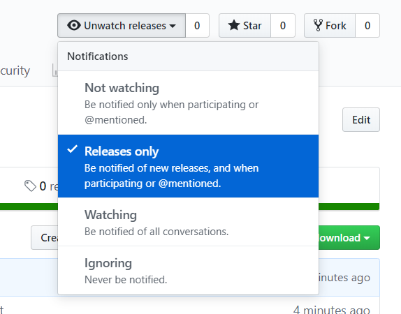

<!--

-->
<h1 align="center">📌AGDDoS</h1>

    &nbsp;
    &nbsp;
    &nbsp;
    &nbsp;
    

> High-performance website testing tool written in Golang.

## Features
:heavy_check_mark: Protocol Agnostic - Currently supporting *HTTP, HTTPS, HTTP/2*. Other protocols are on the way.

:heavy_check_mark: High-performance - Using the world #1 high-performance language -- Golang.

:heavy_check_mark: Different Test Methods - Test your system's limits across different methods.

:heavy_check_mark: Scalable - We provide you some APIs to use `AGDDoS` in your project.

## 🎈 Installation

**[⚡️Click Here to Download the Latest Release](https://github.com/AGDDoS/AGDDoS/releases/)** | [☁备用下载-Mirror] | [☁备用下载-FastGitMirror]

If you want to get the latest version notice, please give us a watching. Thanks!

## 🔨 Usage

1. First, your system needs to meet the following conditions:

    * Windows 7 or higher, **Windows XP / 2003 / 2007 is NOT supported**.

2. Close the security software and firewall before using this program.

3. **Run this program as an administrator**, then use `.\AGDDoS -h` to see help.

## 👪 Communication

You can join our [QQGroup] or become a [contributor][repo] for [issues], feature requests, feedbacks or anything else. 

## 🍱 Disclaimer

`AGDDoS` is created for testing the performance of web applications.
Users MUST be the owner of the target system.
DO NOT use the script with the intention of hurting someone!
Using it for harmful purposes is extremely forbidden.
Our team & company is not responsible for its’ usages and consequences.

## 📄 License

**WTFPL**

---
Proudly build with :heart: & Golang

[☁备用下载-Mirror]: https://index.pig2333.workers.dev/AGDDoS/AGDDoS/releases/
[☁备用下载-FastGitMirror]: https://hub.fastgit.xyz/AGDDoS/AGDDoS/releases/
[QQGroup]: https://jq.qq.com/?_wv=1027&k=OR48TYbJ
[repo]: https://github.com/AGDDoS/AGDDoS/
[issues]: https://github.com/AGDDoS/AGDDoS/issues/new/choose?milestone=2022.6
[购买支持者证书]: https://afdian.net/@xiaozhu2021
